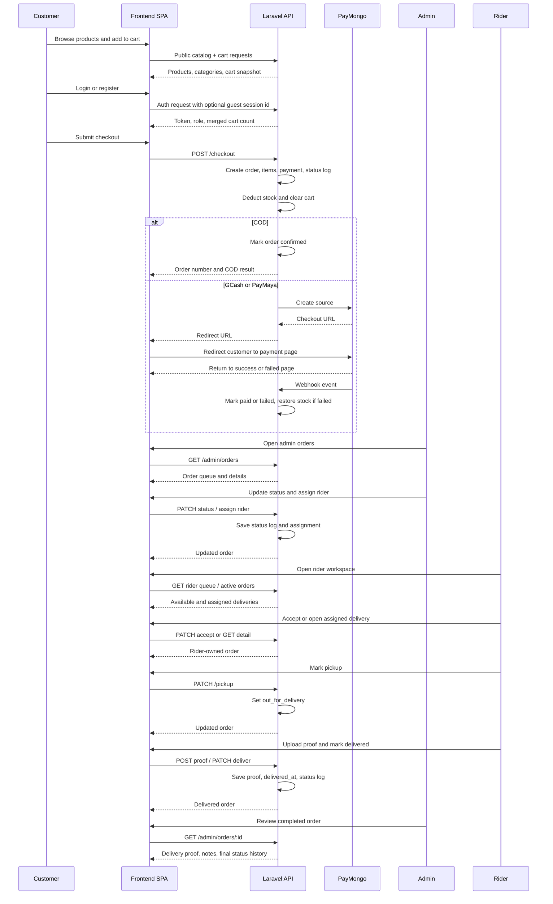

# BrewHaus System Flow

## Scope

This document describes the current end-to-end system flow implemented in the BrewHaus codebase.

It covers:

- public storefront browsing
- guest and authenticated cart behavior
- customer checkout and payment
- admin operations
- rider delivery execution
- final order review and completion

The flow described here is based on the actual route and service implementation in the current frontend and backend.

## System Areas

The application is split into four main areas:

1. Public store
2. Customer account
3. Admin workspace
4. Rider workspace

Frontend route ownership:

- `/`, `/shop`, `/products/:slug`, `/checkout`
- `/customer/*`
- `/admin/*`
- `/rider/*`

Backend API ownership:

- `/api/v1/auth/*`
- `/api/v1/products`, `/api/v1/categories`, `/api/v1/cart*`
- `/api/v1/checkout*`
- `/api/v1/customer/*`
- `/api/v1/admin/*`
- `/api/v1/rider/*`
- `/api/v1/webhooks/paymongo`

## Access Model

Role protection exists in both layers.

Frontend:

- `RoleGuard` protects `/admin/*`, `/customer/*`, and `/rider/*`.
- Unauthenticated users are redirected to `/login`.
- Authenticated users with the wrong role are redirected to their own home area.

Backend:

- Sanctum protects authenticated routes.
- Spatie role middleware protects role-specific API groups.

Result:

- `admin` can access only admin APIs and admin routes.
- `customer` can access only customer and checkout APIs and customer routes.
- `rider` can access only rider APIs and rider routes.

## High-Level Lifecycle

The normal business lifecycle is:

1. Customer browses products.
2. Customer adds items to cart.
3. Guest cart merges into user cart on login.
4. Customer checks out with COD, GCash, or PayMaya.
5. Order, payment, and inventory deductions are created.
6. Admin reviews and advances the order.
7. Admin assigns a rider, or rider accepts from queue.
8. Rider picks up the order and begins delivery.
9. Rider uploads proof and marks the order delivered.
10. Admin reviews the completed order and proof.
11. Customer sees the final order state in account history.

## 1. Storefront Flow

Purpose:

- expose active products from active categories
- support browsing, discovery, and add-to-cart

Behavior:

- products are fetched from the public catalog
- inactive products are hidden
- products in inactive categories are hidden
- filters support search, category, featured, on-sale, and sort options
- product detail includes related products from the same category

Important rule:

- the storefront only shows products that are valid for sale right now

## 2. Cart Flow

Purpose:

- allow shopping before login
- preserve cart intent across authentication

Behavior:

- guests use a generated local `session_id`
- cart API resolves either:
  - authenticated user cart
  - guest session cart
- quantities are capped at `min(10, stock_quantity)`
- inactive or unavailable products are blocked

Guest-to-user merge:

1. guest adds items while unauthenticated
2. local storage keeps the guest cart session id
3. user logs in
4. backend merges guest items into the user cart
5. merged cart count is returned in login response
6. guest session id is cleared on the frontend

This prevents cart loss during login.

## 3. Auth Flow

Purpose:

- support self-registration for customers
- authenticate admins, customers, and riders
- keep session state in the SPA

Behavior:

- registration creates only `customer` accounts
- admin creates rider accounts through the admin workspace
- login returns:
  - user
  - token
  - role
  - cart count
- auth state is persisted in the frontend store
- `/auth/me` refreshes the current authenticated profile

Important rule:

- inactive accounts are blocked at login

## 4. Checkout Flow

Purpose:

- convert cart state into a committed order
- reserve stock
- initiate payment when needed

Checkout validation:

- user must be authenticated as `customer`
- shipping address must belong to the user
- cart must be valid and in stock
- optional coupon is revalidated against the current cart
- COD eligibility is checked for the address

Inside checkout transaction:

1. cart snapshot is resolved
2. shipping fee is calculated
3. coupon discount is resolved if present
4. order record is created
5. order items are created
6. stock is deducted from products
7. inventory logs are written
8. payment record is created
9. status log is written
10. cart items are cleared

Important system behavior:

- stock is deducted at checkout initiation, not at delivery time

## 5. Payment Branches

### COD branch

Flow:

1. customer submits checkout with `payment_method = cod`
2. order is created with `payment_status = pending`
3. order is immediately promoted to `confirmed`
4. confirmation job is dispatched
5. no PayMongo redirect is required

Effect:

- COD is operationally treated as a confirmed order after checkout

### GCash / PayMaya branch

Flow:

1. customer submits checkout with `gcash` or `paymaya`
2. order is created with pending state
3. PayMongo source is created
4. checkout URL is returned to the frontend
5. customer is redirected to PayMongo
6. PayMongo redirects back to success or failed page
7. webhook finalizes payment status

Important rule:

- redirect is not the source of truth
- webhook processing is the source of truth

## 6. PayMongo Webhook Flow

Purpose:

- finalize online payment outcome
- recover inventory on failed payment

Supported events:

- `payment.paid`
- `payment.failed`
- `source.chargeable`

Behavior:

- webhook signature is verified
- invalid signatures are rejected
- `source.chargeable` creates a payment from the source
- `payment.paid` marks payment paid and usually promotes order to `confirmed`
- `payment.failed` marks payment failed, restores stock, releases coupon usage, and cancels the order

Important operational dependency:

- online order completion depends on reliable webhook delivery

## 7. Customer Post-Checkout Flow

Purpose:

- let customers review and track their own orders

Behavior:

- customers can list only their own orders
- customers can inspect full order detail by order number
- customer sees payment, items, shipping, status history, and rider info when available

Cancellation rule:

- customer cancellation is allowed only when:
  - `order_status = pending`
  - `payment_status = pending`

Consequence:

- COD orders usually cannot be customer-cancelled after checkout because they are auto-confirmed

## 8. Admin Flow

Purpose:

- run operations after checkout
- maintain catalog and stock
- dispatch riders

Admin modules:

- Dashboard
- Orders
- Order Detail
- Products
- Product Form
- Categories
- Coupons
- Inventory
- Users

Operational admin sequence:

1. review dashboard health
2. review incoming orders
3. move order through preparation states
4. assign rider when ready
5. monitor delivery progression
6. review proof and completion

Catalog sequence:

1. create or update categories
2. create or update products
3. manage images, pricing, tags, and visibility

Promotion sequence:

1. create coupon
2. set value and rules
3. activate or deactivate as needed

Inventory sequence:

1. review low stock products
2. restock with quantity and note
3. inspect inventory logs

Rider onboarding sequence:

1. create rider account in Users
2. ensure rider is active
3. assign rider from Orders or Order Detail

## 9. Admin Order Status Flow

The admin service supports these statuses:

1. `pending`
2. `confirmed`
3. `processing`
4. `packed`
5. `shipped`
6. `out_for_delivery`
7. `delivered`
8. `cancelled`
9. `refunded`

Rules:

- `out_for_delivery` and `delivered` require a rider assignment
- cancelled or refunded orders cannot re-enter the active flow
- moving to `cancelled` or `refunded` restores stock and releases coupon usage
- moving to `refunded` also updates payment status

Important note:

- admin can mark an order `delivered` without enforcing rider proof-of-delivery rules

## 10. Rider Flow

Purpose:

- execute the last-mile delivery workflow

Rider surfaces:

- active deliveries
- open queue
- delivery history
- delivery detail

Rider operational sequence:

1. rider logs in
2. rider sees assigned work and queue
3. rider accepts an available packed or shipped order, or works an already assigned order
4. rider picks up the order
5. order becomes `out_for_delivery`
6. rider location updates can be pushed while the order is live
7. rider uploads proof
8. rider marks delivery complete
9. order becomes `delivered`

Issue reporting:

- rider can report delivery issues
- current implementation stores the issue as a status log note

## 11. Rider Delivery Rules

Accept:

- only unassigned `packed` or `shipped` orders can be accepted

Pickup:

- only `packed` or `shipped` assigned orders can move to `out_for_delivery`

Proof upload:

- proof can only be uploaded while order is `out_for_delivery`

Deliver:

- only `out_for_delivery` orders can be delivered
- proof image is required unless one already exists on the order

Location updates:

- rider can push current coordinates to update live location fields

## 12. Status Logs and Audit Trail

The system writes status logs from multiple actors:

- checkout flow
- admin status updates
- rider acceptance
- rider pickup
- rider proof upload
- rider delivery completion
- rider issue reports
- customer cancellation
- payment webhook results

This produces a useful operational history for order review.

## 13. Sequence Diagram

## 14. Customer to Admin to Rider Handoff

Handoff 1: Customer -> Admin

- happens after order creation
- admin becomes responsible for preparation and dispatch

Handoff 2: Admin -> Rider

- happens when rider is assigned or rider accepts from queue
- rider becomes responsible for last-mile execution

Handoff 3: Rider -> Admin review

- happens when proof is uploaded and delivery is completed
- admin becomes responsible for final oversight and issue review

## 15. Failure and Recovery Paths

Customer cancellation:

- pending unpaid orders only
- stock is restored
- coupon usage is released

Online payment failure:

- webhook marks payment failed
- stock is restored
- coupon usage is released
- order is cancelled

Invalid rider acceptance:

- blocked if another rider already claimed the order
- blocked if status is not `packed` or `shipped`

Invalid delivery completion:

- blocked if order is not `out_for_delivery`
- blocked if proof is missing

## 16. Current Risks and Gaps

1. Online payment depends on webhook delivery.
   If webhook processing fails, online orders may remain in an unresolved state after stock has already been deducted.

2. Admin can bypass rider proof rules.
   Admin status updates allow `delivered` when a rider is assigned, but do not require proof-of-delivery.

3. COD customer cancellation window is narrow.
   Because COD orders are auto-confirmed, customer self-cancel is effectively unavailable after checkout.

4. Rider issue reporting is lightweight.
   Issues are logged as status notes, not as a dedicated issue workflow with stronger admin handling.

5. Assignment can auto-promote early statuses.
   Rider assignment can move some early orders to `packed`, which may compress preparation and dispatch states.

## 17. Recommended Reading Order

To understand the implementation quickly, read these in order:

1. `backend/routes/api.php`
2. `brewhaus-frontend/src/router/index.jsx`
3. `backend/app/Services/CartService.php`
4. `backend/app/Services/AuthService.php`
5. `backend/app/Services/CheckoutService.php`
6. `backend/app/Services/Admin/AdminOrderService.php`
7. `backend/app/Services/Rider/RiderOrderService.php`
8. `backend/app/Repositories/OrderRepository.php`

## Summary

BrewHaus is implemented as a role-based commerce and delivery workflow:

- the public store drives discovery
- the customer flow creates orders and initiates payment
- the admin flow controls preparation, stock, and dispatch
- the rider flow completes the last-mile delivery
- the admin flow closes the loop through proof and final order review

The architecture is coherent and operationally clear. The main attention points are payment webhook reliability, proof enforcement consistency, and stronger issue-handling around rider exceptions.
